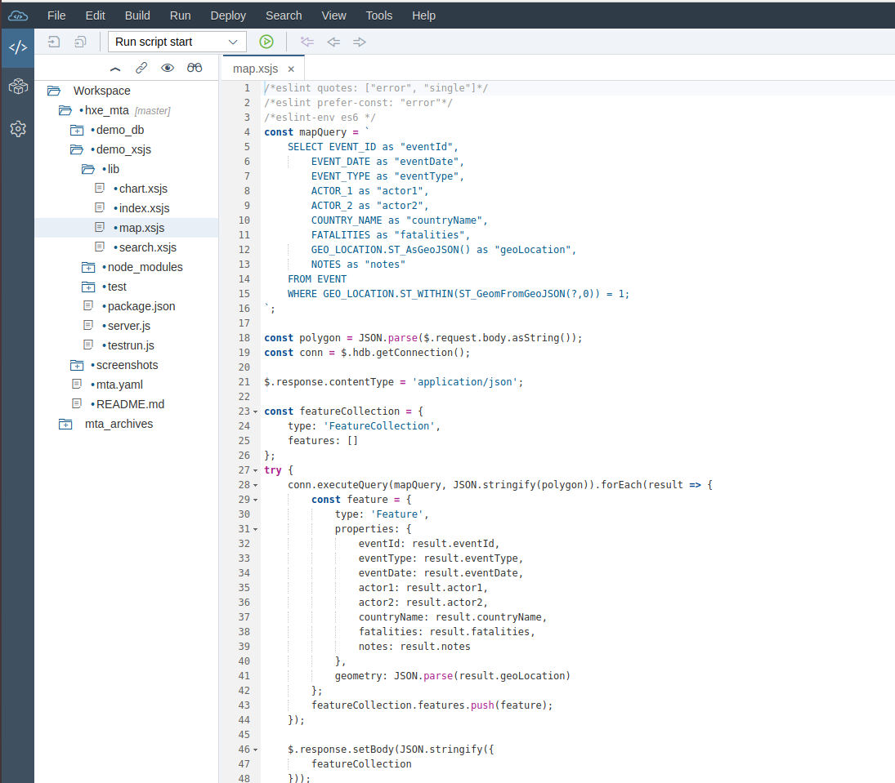
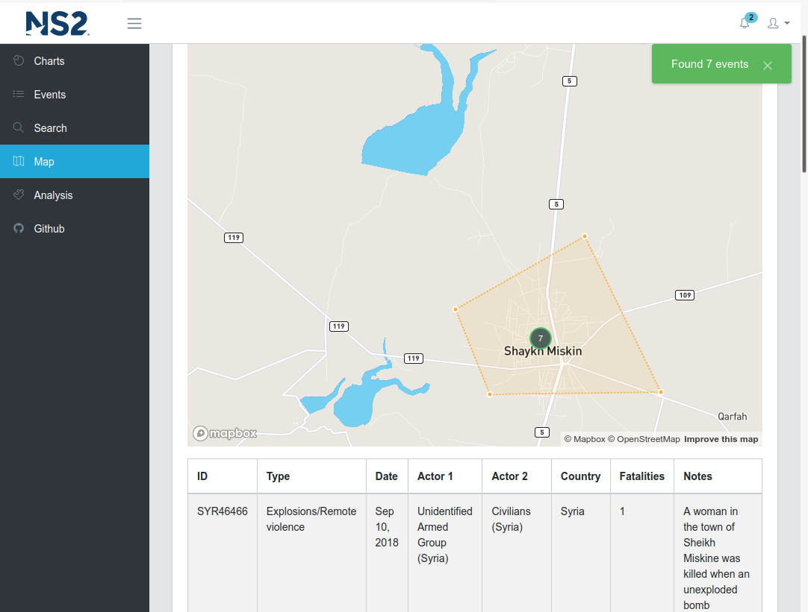
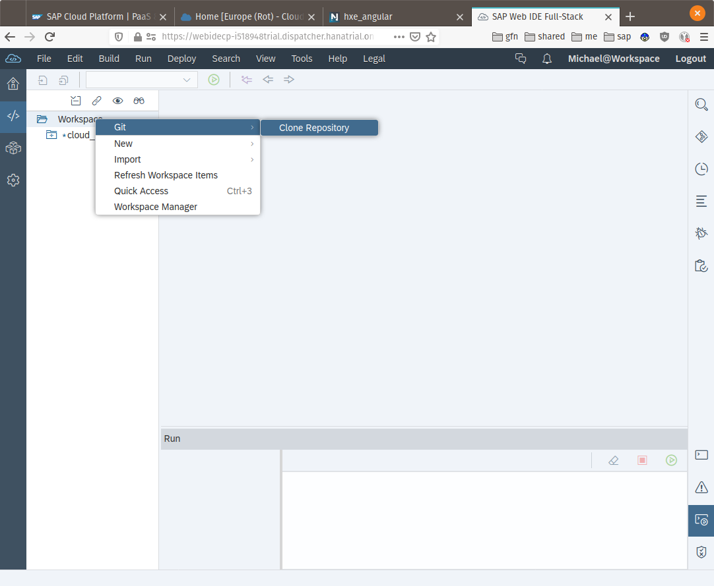
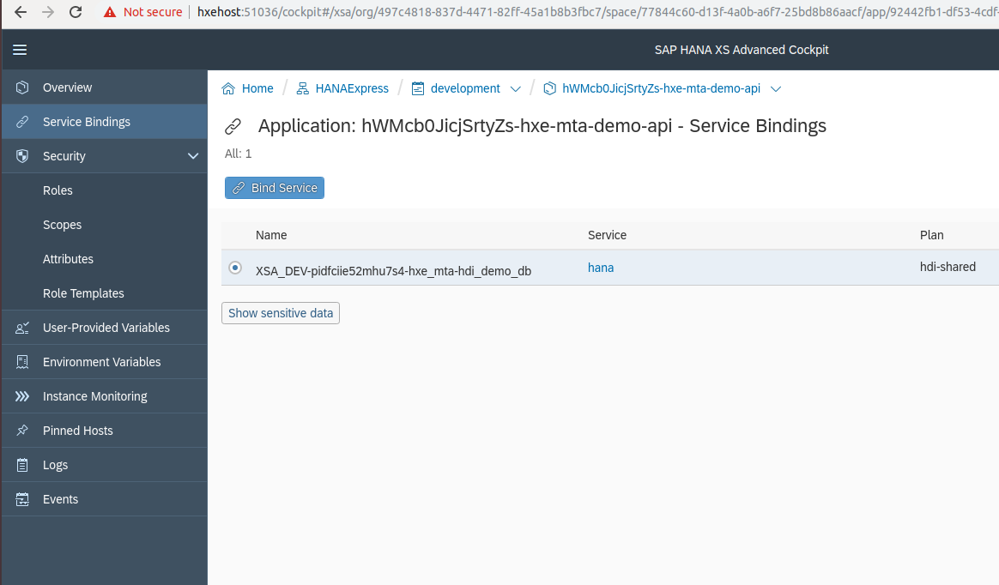

# hxe-mta
A [SAP HANA](https://developers.sap.com/topics/sap-webide.html) multi target application that loads data provided by the [Armed Conflict Location & Event Data](https://www.acleddata.com) project and provides a REST API to power data viewing, search, charts and spatial queries.  

This application was developed using [SAP HANA Express](https://developers.sap.com/topics/sap-hana.html)



A web application that can take advantage of the REST is [github/mechevarria/hxe_angular](https://github.com/mechevarria/hxe_angular)



## Import to WebIDE

To run this project, use the git clone option in [SAP HANA webide](https://developers.sap.com/topics/sap-webide.html) to bring in the project



### Build the database module

> right-click on **demo_db** -> build -> build

This will create the **EVENT** table, full-text index for search and load data from `demo_db/src/data/event.csv`

### Build and deploy the node service

> right-click on **demo_api** -> build -> build

After building, deploy the application

> right-click on **demo_api** -> Run -> Run as Node.js Application

Thats it! Your application will be running on the link shown in the console

## Develop locally

The `demo_xsjs` node service can be developed locally by adding **one** file.

Create `default-services.json` inside the `hxe_mta/demo_xsjs` folder. Add the following to the file

```json
{
  "hana": {
  }
}
```

> Do **not** check `default-services.json` into source control. This file will contain the HANA connection properties that are usually injected as an environment variable at runtime. `default-services.json` is already added to `.gitignore` in the `demo_xsjs` module.

Get the connection properties logging into the [HANA Express Cockpit](https://developers.sap.com/tutorials/xsa-explore-basics.html) and copying the HANA service credentials

> Home > HANAExpress > development > Service Instances (on the left)



> Select **Show sensitive data** and copy the contents to the `hana` object in `default-services.json`. Your file should look like below

```json
{
  "hana": {
    "schema": "DEMO_DB",
    "hdi_password": "<YOUR_PASSWORD_VALUE>",
    "tenant_name": "HXE",
    "password": "<YOUR_PASSWORD_VALUE>",
    "port": "39015",
    "encrypt": false,
    "db_hosts": [
      {
        "port": 39015,
        "host": "hxehost"
      }
    ],
    "host": "hxehost",
    "hdi_user": "DEMO_DB_71OEEN6U5R5WKIHHNA7EJV95S_DT",
    "user": "DEMO_DB_71OEEN6U5R5WKIHHNA7EJV95S_RT",
    "url": "jdbc:sap://hxehost:39015/?currentschema=DEMO_DB"
  }
}
```

To install, run the following
```bash
npm install
```

Then to start the nodejs application, run
```bash
npm run start
```

### Highlighting in VSCode

To get syntax highlighting for `xsjs` files, open the app Settings

> User > Settings > Text Editor > Files > Edit in `Settings.json`

Then add the following

```json
"files.associations": {
  "*.xsjs": "javascript"
}
```

## Further help

To learn more about SAP HANA development capabilities, go to [developers.sap.com](https://developers.sap.com/)