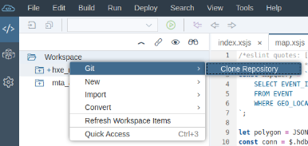

# hxe-mta
A [SAP HANA](https://developers.sap.com/topics/sap-webide.html) multi target application that loads data provided by the [Armed Conflict Location & Event Data](https://www.acleddata.com) project and provides a REST API to power data viewing, search, charts and spatial queries.  

This application was developed using [SAP HANA Express](https://developers.sap.com/topics/sap-hana.html)

A web application that can take advantage of these services is [github/mechevarria/hxe_angular](https://github.com/mechevarria/hxe_angular)

## Import

To run this project, use the git clone option in [SAP HANA webide](https://developers.sap.com/topics/sap-webide.html) to bring in the project

### Build the database module

> right-click on **demo_db** -> build -> build

This will create the **EVENT** table, full-text index for search and load data from `demo_db/src/data/event.csv`

### Build and deploy the services

> right-click on **demo_api** -> build -> build

After building, deploy the application

> right-click on **demo_api** -> Run -> Run as Node.js Application

## Further help

To learn more about SAP HANA development capabilities, go to [developers.sap.com](https://developers.sap.com/)