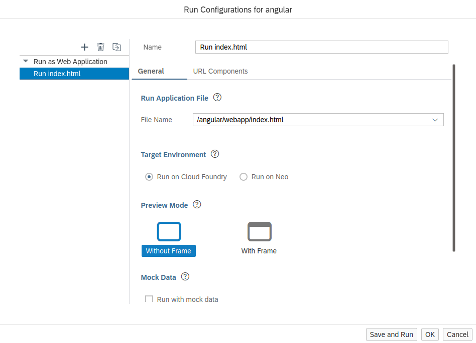
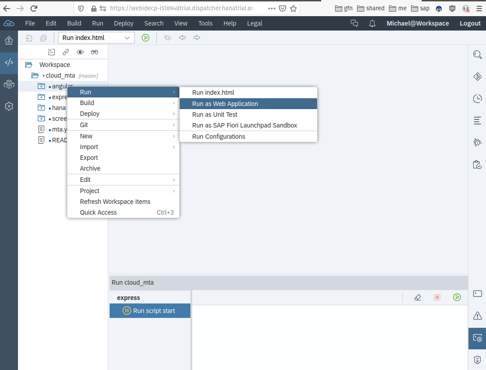

# SAP Cloud Platform Multi-Target-Application (MTA)
A [SAP HANA](https://developers.sap.com/topics/sap-webide.html) multi target application that loads data provided by the [Armed Conflict Location & Event Data](https://www.acleddata.com) project and provides a REST API to power data viewing, search, charts and spatial queries along with an [Angular](https://angular.io/) web application 

This application was developed using [SAP HANA Express](https://developers.sap.com/topics/sap-hana.html)


## Import to WebIDE

To run this project, use the git clone option in [SAP HANA webide](https://developers.sap.com/topics/sap-webide.html) to bring in the project via the git url `https://github.com/mechevarria/cloud_mta.git`


### Build the database module

> right-click on **hana** -> build -> build

This will create the **EVENT** table, full-text index for search and load data from `hana/src/data/event.csv`

### Build and deploy the node service

The REST API is implemented as a standard [Express](https://expressjs.com/) application.

* The Express implementation gives you all the flexibility of the working just with Express but requires you to wire your own routes for services like in any Express application.


> right-click on **express** -> build -> build

After building, deploy the application

> right-click on **express** -> Run -> Run as Node.js Application

Thats it! Your application will be running on the link shown in the console

### Build and deploy the Angular frontend

Make sure the **Run as Web Application** is on **Cloud Foundry**, not Neo by checking the **Run Configurations** option

> right-click on **angular** -> Run -> Run Configurations



> right-click on **angular** -> Run -> Run as Web Application



The assets in the `webapp` directory are the distribution output from the build process in [github/mechevarria/cp_angular](https://github.com/mechevarria/cp_angular)


## Develop locally or Run in Docker

The `express` node service can be developed locally or run in docker by adding **one** file.

The `express` folder has a `Dockerfile` to run as a docker container

Create `default-services.json` inside the `/tmp` folder (this path can be changed in `server.js`). Add the following to the file

```json
{
  "hana": {
  }
}
```

> Do **not** check `default-services.json` into source control. This file will contain the HANA connection properties that are usually injected as an environment variable at runtime. `default-services.json` is already added to `.gitignore` in the `express` module.

Get the connection properties logging into the [HANA Express Cockpit](https://developers.sap.com/tutorials/xsa-explore-basics.html) and copying the HANA service credentials

> Home > HANAExpress > development > Service Instances (on the left)


> Select **Show sensitive data** and copy the contents to the `hana` object in `default-services.json`. Your file should look like below

```json
{
  "hana": {
    "schema": "hana",
    "hdi_password": "<YOUR_PASSWORD_VALUE>",
    "tenant_name": "HXE",
    "password": "<YOUR_PASSWORD_VALUE>",
    "port": "39015",
    "encrypt": false,
    "db_hosts": [
      {
        "port": 39015,
        "host": "hxehost"
      }
    ],
    "host": "hxehost",
    "hdi_user": "hana_71OEEN6U5R5WKIHHNA7EJV95S_DT",
    "user": "hana_71OEEN6U5R5WKIHHNA7EJV95S_RT",
    "url": "jdbc:sap://hxehost:39015/?currentschema=hana"
  }
}
```

### Run Local

To install, run the following
```bash
npm install
```

Then to start the nodejs application, run
```bash
npm run start
```

### Run in docker

Running in docker still requires the creation of `default-services.json` that is mounted at runtime. Use this script to build the container

```bash
./docker-build.sh
```

Then run with

```bash
./docker-run.sh
```

## Further help

To learn more about SAP HANA development capabilities, go to [developers.sap.com](https://developers.sap.com/). You can filter the number of tutorials by [SAP Hana or SAP HANA Express Edition](https://developers.sap.com/tutorial-navigator.html?tag=products:technology-platform/sap-hana&tag=products:technology-platform/sap-hana/sap-hana-express-edition)
